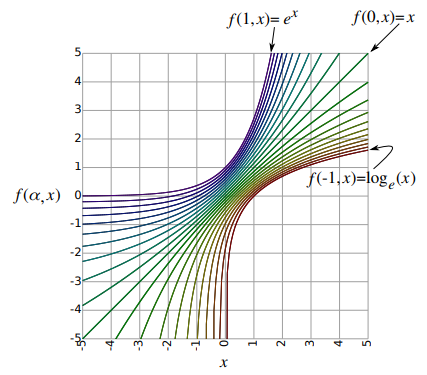
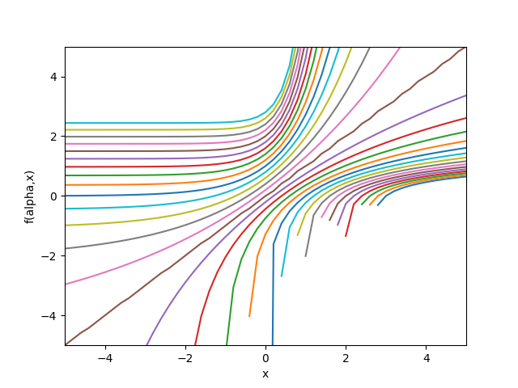
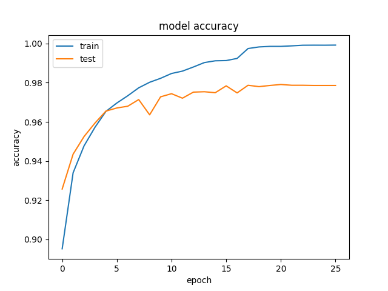
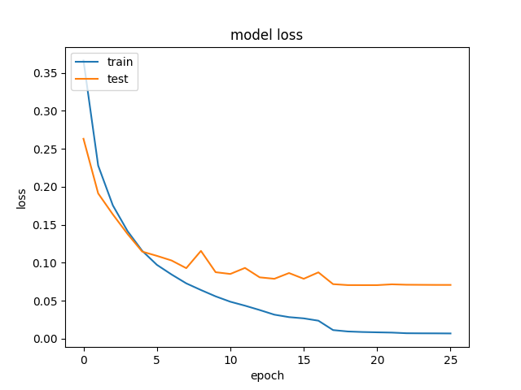

# Soft-Exponential-Activation-Function:

Implementation of parameterized soft-exponential activation function. In this implementation, the parameters are the same for all neurons initially starting with -0.01. This activation function revolves around the idea of a "soft" exponential function. The soft-exponential function is a function that is very similar to the exponential function, but it is not as steep at the beginning and it is more gradual at the end. The soft-exponential function is a good choice for neural networks that have a lot of connections and a lot of neurons.

This activation function is under the idea that the function is logarithmic, linear, exponential and smooth.

The equation for the soft-exponential function is:

$$ f(\alpha,x)=   \left\{
\begin{array}{ll}
      -\frac{ln(1-\alpha(x + \alpha))}{\alpha} & \alpha < 0\\
      x & \alpha = 0 \\
      \frac{e^{\alpha x} - 1}{\alpha} + \alpha & \alpha > 0 \\
\end{array} 
\right.  $$

# Problems faced:

## 1. Misinformation about the function

From a paper by [A continuum among logarithmic, linear, and exponential functions, and
its potential to improve generalization in neural networks](https://arxiv.org/pdf/1602.01321.pdf#:~:text=Abstract%3A%20We%20present%20the%20soft,of%20the%20network%20is%20trained.), here in Figure 2, the soft-exponential function is shown as a logarithmic function. This is not the case.



The real figure should be shown here:



Here we can see in some cases the soft-exponential function is undefined for some values of $\alpha$,$x$ and $\alpha$,$x$ is not a constant.

## 2. Negative values inside logarithm

Here comes the tricky part. The soft-exponential function is defined for all values of $\alpha$ and $x$. However, the logarithm is not defined for negative values.

In the issues under [Keras](https://github.com/keras-team/keras/issues/3842), one of the person has suggested to use the following function $sinh^{-1}()$ instead of the $\ln()$.

## 3. Initialization of alpha

Starting with an initial value of -0.01, the soft-exponential function was steep at the beginning and it is more gradual at the end. This was a good idea.

# Performance:

First picture showing the accuracy of the soft-exponential function.



This shows the loss of the soft-exponential function.



Model Structure:

```text
_________________________________________________________________
 Layer (type)                Output Shape              Param #   
=================================================================
 input_1 (InputLayer)        [(None, 28, 28)]          0         
                                                                 
 flatten (Flatten)           (None, 784)               0         
                                                                 
 dense_layer (Dense_layer)   (None, 128)               100480    
                                                                 
 parametric_soft_exp (Parame  (None, 128)              128       
 tricSoftExp)                                                    
                                                                 
 dense_layer_1 (Dense_layer)  (None, 128)              16512     
                                                                 
 parametric_soft_exp_1 (Para  (None, 128)              128       
 metricSoftExp)                                                  
                                                                 
 dense (Dense)               (None, 10)                1290      
                                                                 
=================================================================
Total params: 118,538
Trainable params: 118,538
Non-trainable params: 0
```

# Acknowledgements:

- [A continuum among logarithmic, linear, and exponential functions, and
its potential to improve generalization in neural networks](https://arxiv.org/pdf/1602.01321.pdf#:~:text=Abstract%3A%20We%20present%20the%20soft,of%20the%20network%20is%20trained.)

- [Keras issues 3842](https://github.com/keras-team/keras/issues/3842)